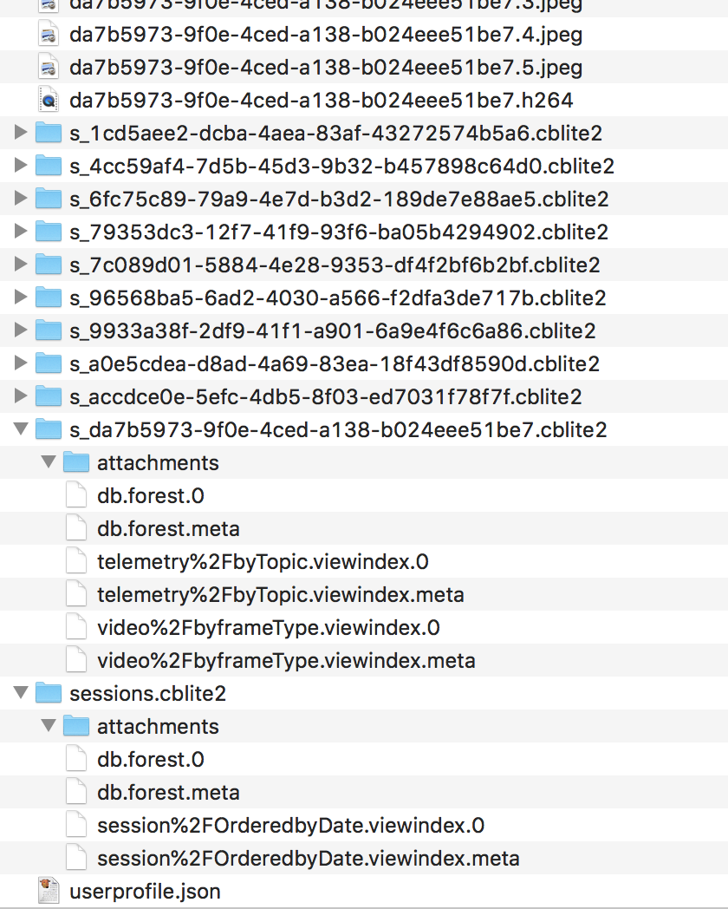
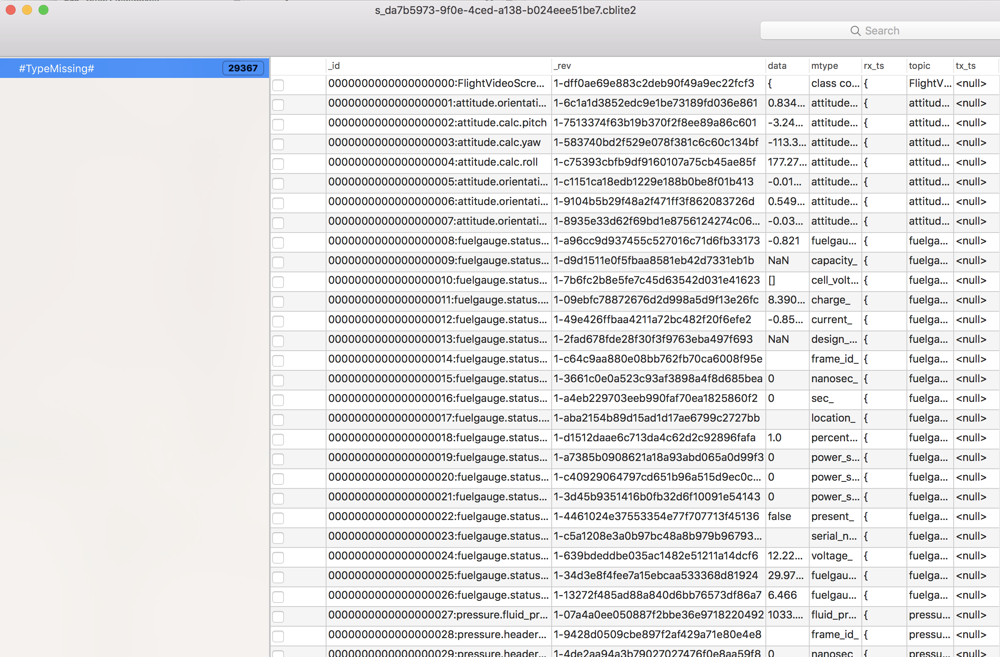

# trident-hacks

This repository is for me to collect information I've learned about the Trident OpenROV that isn't documented anywhere else.

# Compass and Calibration

From https://forum.openrov.com/t/how-to-use-the-trident-display-to-full-advantage/6243/14:

Trident has an internal magnetic compass, and fuses its data with a rate gyro. To calibrate this pair of 
sensors, rotate the vehicle back and forth around each of its three axes.

The JXD S192 Game Pad, which OpenROV sells as the preferred controller, does not have an internal compass.
This means that the Pilot display of OpenROV Cockpit cannot display heading of the controller.
To visualize the true direction of the vehicle, you'll need an
external compass or some other cue for situational awareness. 

# Controller software

Set up an account for yourself on 
the Google Play store (https://play.google.com/store/account). OpenROV Cockpit is publicly available to all as of June 2018; there's
no longer a need to apply for the private beta.

Large video files from your dives take a while to process. Wait for the Cockpit's processing to finish before you try to export them. 
If you can't watch the video from within Cockpit, they're not ready to export yet.

# Files on the controller

Using Android File Transfer (https://www.android.com/filetransfer/) I
was able to see the internal file structure. Within folder
/Android/data/com.openrov.cockpit/files/data are a bunch of JPEGs and
H264s.

The H264 files were easily converted to MP4 files using HandBrake: https://handbrake.fr.

There's also userprofile.json, sessions.cblite2, and a few
.cblite2 files named with a GUID name scheme. 

userprofile.json appears to have just the Google Play account information used to download the app.

Because the .cblite2 files use forestdb for storage, we know that CBLite version 1.4 or older was used to create them. CBLite 1.4.0.1 is available at https://github.com/couchbase/couchbase-lite-ios/releases/tag/1.4.0.1.

I used CBLitePro to investigate the .cblite2 files. CBLitePro is
available on the Mac App Store
(https://itunes.apple.com/us/app/cblitepro/id1326527927?mt=12), but
can't export the data. There's nothing else it can show us beyond the
notes here, and it's not a tool you need to buy.

sessions.cblite2 indexes the GUID-named files, with a Unix-style
timestamp.

Filenames for the JPEG, H264, and .cblite2 follow the same GUID pattern.

Folders named <GUID>.cblite2 represent individual dives. These
databases have timestamped values for telemetry: attitude, depth,
temperature, battery status, camera reports, and more.

To do: explore these files with
https://github.com/couchbase/couchbase-lite-core/wiki/The-%27cblite%27-Tool
and try to export the data.
